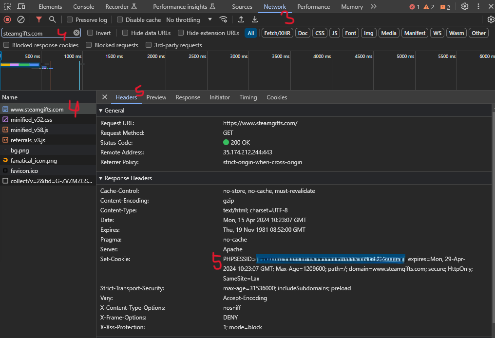

# steamgifts-bot
Small Golang tool to automate entering giveaways in SteamGifts page.
It accesses SteamGifts wishlist and DLC pages and enters all giveaways in them.

Accessing wishlist and dlc is configurable and randomized between min and max values.

Entering giveaways is configurable and randomized between min and max values.

## Building application
### For current arch+os
```
cd cmd/sg_bot
go build
```
### For raspberry pi
Set environment variables:
```
GOOS="linux"
GOARM="5"
GOARCH="arm
```
and build like before using `go build`
#### Example for Windows
In powershell console
```powershell
$Env:GOOS = "linux"
$Env:GOARM = "5"
$Env:GOARCH="arm"
go build
```

## Using application
Set env variable `SGBOT_PHPSESSID` and run executable.
Other env vars:
- `SGBOT_PHPSESSID` - your PHPSESSID obtained from requests to SteamGifts pages
- `SGBOT_WAITFORGIVEAWAYMIN` - min amount of seconds to wait before entering giveaway
- `SGBOT_WAITFORGIVEAWAYMAX` - max amount of seconds to wait before entering giveaway
- `SGBOT_SYNCWITHSTEAM` - sync with steam each time before accessing steamgifts wishlist
- `SGBOT_PAGESTOSCAN` - list of pages to scan, defaults to [ "dlc", "wishlist", "multiplecopies", "recommended" ]

Just paste your `PHPSESSID` and run the binary.
### Obtaining PHPSESSID
1. Log to SteamGifts with your Steam account
1. Open browsers developer tools (on Chrome its `CTRL+SHIFT+I`) 
1. Go to `Network` tab
1. Filter only requests from `steamgifts.com` and refresh page
1. Copy `PHPSESSID` from `Headers` (see screenshot)
1. Paste into `config.json`

Example screenshot:


## docker-compose
```yaml
services:
  sgbot:
    image: naata/sg_bot:latest
    deploy:
      resources:
        limits:
          cpus: '1'
          memory: 64M
    environment:
      SGBOT_PHPSESSID: <php_session_id>
    restart: unless-stopped
```